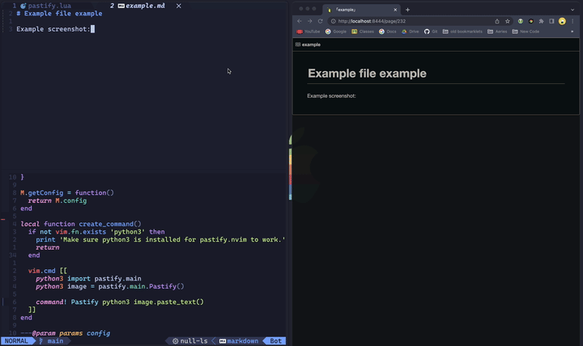
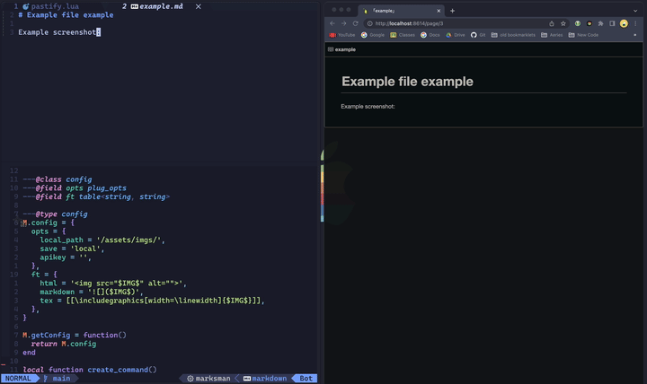

# pastify.nvim

<div align="center">
  <p><strong>Paste screenshots directly into files asynchronously</strong></p>
</div>

Local Saving               |  Online Hosting
:-------------------------:|:-------------------------:
  |  

To use this plugin, use `:Pastify` command, which will take the clipboard content and paste it before the cursor. Using the `:PastifyAfter` command will paste the text after the cursor.

If an image is stored in the system clipboard then Pastify will save the image to a local directory (specified by the configuration) and insert the path as text into the buffer. The specific text that is inserted can be customized for different filetype (see the configuration section below). If an image is stored in the system clipboard and an API key is provided, Pastify will upload the image to the specified online service and insert the URL into the buffer. If the clipboard contains text, then the text will be pasted into the buffer.

## Requirements

- Neovim 0.8+
- MacOS or Windows (No extra tools needed)
- Linux (with `xclip` or `wl-paste` installed)
- Python3
- Pip3
- For saving images online
  - [Imgbb](https://api.imgbb.com/) api key (free)

## Installation

Make sure Neovim has python3 by running `:checkhealth`, if you have python but it is not linked, run `pip3 install neovim`.
Then, run `pip3 install pillow`.

```lua
return {
  'TobinPalmer/pastify.nvim',
  cmd = { 'Pastify', 'PastifyAfter' },
  config = function()
    require('pastify').setup {
      opts = {
        apikey = "YOUR API KEY (https://api.imgbb.com/)", -- Needed if you want to save online.
      },
    }
  end
}
```

## Configuration

These are the default options, you don't need to copy them into `setup()`

```lua
require('pastify').setup {
  opts = {
    absolute_path = false, -- use absolute or relative path to the working directory
    apikey = '', -- Api key, required for online saving
    local_path = '/assets/imgs/', -- The path to put local files in, ex <cwd>/assets/images/<filename>.png
    save = 'local', -- Either 'local' or 'online' or 'local_file'
    filename = '', -- The file name to save the image as, if empty pastify will ask for a name
    -- Example function for the file name that I like to use:
    -- filename = function() return vim.fn.expand("%:t:r") .. '_' .. os.date("%Y-%m-%d_%H-%M-%S") end,
    -- Example result: 'file_2021-08-01_12-00-00'
    default_ft = 'markdown', -- Default filetype to use
  },
  ft = { -- Custom snippets for different filetypes, will replace $IMG$ with the image url
    html = '',
    markdown = '',
    tex = [[\includegraphics[width=\linewidth]{$IMG$}]],
    css = 'background-image: url("$IMG$");',
    js = 'const img = new Image(); img.src = "$IMG$";',
    xml = '<image src="$IMG$" />',
    php = '<?php echo ""; ?>',
    python = '# $IMG$',
    java = '// $IMG$',
    c = '// $IMG$',
    cpp = '// $IMG$',
    swift = '// $IMG$',
    kotlin = '// $IMG$',
    go = '// $IMG$',
    typescript = '// $IMG$',
    ruby = '# $IMG$',
    vhdl = '-- $IMG$',
    verilog = '// $IMG$',
    systemverilog = '// $IMG$',
    lua = '-- $IMG$',
  },
}
```

#### Options

**aboslute_path** - If true, the path will be absolute, if false, the path will be relative to either the current file or current working directory (depending on the **save** option).

**apikey** - The api key for the online service, if you want to save online.

**local_path** - The path to save local files in, relative to the current working directory. This can be a lua function.

**save** - Either 'local' or 'online' or 'local_file'. 'local' will save the image locally relative to the current working directory, 'online' will save the image online, 'local_file' will save the image locally relative to the file path.

**filename** - The filename to save the image as, if empty pastify will ask for a name. This can be a lua function.

**default_ft** - The default filetype to use if the filetype is not in the **ft** table.

#### File Types

Each filetype can have a custom snippet that will replace the variables below. This can be useful for markdown, html, or latex.
* `$IMG$`: The image url
* `$NAME$`: The image filename

### Custom Keybinding

I like to add a custom binding to paste from my system clipboard that doesn't specifically rely on image or text, it simply pastes whatever is in the clipboard.

```lua
vim.api.nvim_set_keymap('v', '<leader>p', ':PastifyAfter<CR>', { noremap = true, silent = true })
vim.api.nvim_set_keymap('n', '<leader>p', ':PastifyAfter<CR>', { noremap = true, silent = true })
vim.api.nvim_set_keymap('n', '<leader>P', ':Pastify<CR>', { noremap = true, silent = true })
```

Or if you prefer to do everything in lazy.nvim, here is my config:

```lua
return {
    'TobinPalmer/pastify.nvim',
    cmd = { 'Pastify', 'PastifyAfter' },
    event = { 'BufReadPost' }, -- Load after the buffer is read, I like to be able to paste right away
    keys = {
        {noremap = true, mode = "x", '<leader>p', "<cmd>PastifyAfter<CR>"},
        {noremap = true, mode = "n", '<leader>p', "<cmd>PastifyAfter<CR>"},
        {noremap = true, mode = "n", '<leader>P', "<cmd>Pastify<CR>"},
    },
    config = function()
        require('pastify').setup({
            opts = {
                absolute_path = false, -- use absolute or relative path to the working directory
                apikey = '', -- Api key, required for online saving
                local_path = '/assets/imgs/', -- The path to put local files in, ex ~/Projects/<name>/assets/images/<imgname>.png
                save = 'local', -- Either 'local' or 'online' or 'local_file'
                filename = function() return vim.fn.expand("%:t:r") .. '_' .. os.date('%Y-%m-%d_%H-%M-%S') end,
                default_ft = 'markdown', -- Default filetype to use
            },
            ft = { -- Custom snippets for different filetypes, will replace $IMG$ with the image url
                html = '',
                markdown = '',
                tex = [[\includegraphics[width=\linewidth]{$IMG$}]],
                css = 'background-image: url("$IMG$");',
                js = 'const img = new Image(); img.src = "$IMG$";',
                xml = '<image src="$IMG$" />',
                php = '<?php echo ""; ?>',
                python = '# $IMG$',
                java = '// $IMG$',
                c = '// $IMG$',
                cpp = '// $IMG$',
                swift = '// $IMG$',
                kotlin = '// $IMG$',
                go = '// $IMG$',
                typescript = '// $IMG$',
                ruby = '# $IMG$',
                vhdl = '-- $IMG$',
                verilog = '// $IMG$',
                systemverilog = '// $IMG$',
                lua = '-- $IMG$',
            },
        })
    end
}
```

## Comparison and similar plugins

| Feature                      | [pastify.nvim](https://github.com/TobinPalmer/pastify.nvim) | [img-paste.vim](https://github.com/img-paste-devs/img-paste.vim) | [clipboard-image.nvim](https://github.com/ekickx/clipboard-image.nvim) |
|------------------------------|-------------------------------------------------------------|------------------------------------------------------------------|------------------------------------------------------------------------|
| Async                        | ✅                                                          |                                                                  |                                                                        |
| Local                        | ✅                                                          | ✅                                                               | ✅                                                                     |
| Online                       | ✅                                                          |                                                                  |                                                                        |
| Highly Customizable          | ✅                                                          |                                                                  | ✅                                                                     |
| Custom Snippets For Filetype | ✅                                                          | ✅                                                               | ✅                                                                     |
| Python or Lua or Vimscript   | Python                                                      | Vimscript                                                        | Lua                                                                    |

